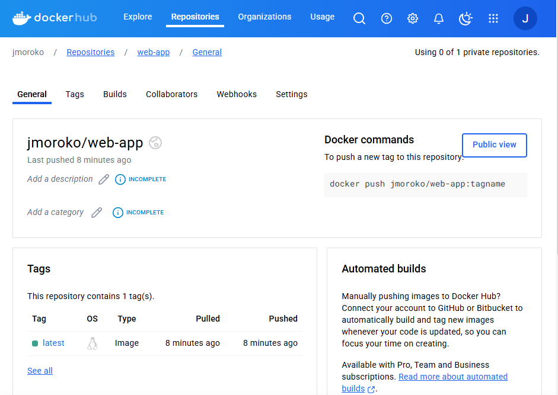

<h1>1. Création du projet et du fichier docker file</h1>

<b>Création du projet HTML</b>

<b>Création du fichier dockerFile</b>

<h1>2. Installation de jenkins</h1>

<b>Téléchargement de jenkins et installation basique</b>

<b>Configuration</b>

Aller dans les services de windows et rechercher le service jenkins

 

Double cliquer sur jenkins, aller dans l'onglet connexion, cliquer sur ce compte, faire parcourir, ajouter le nom d'utilisateur de session de votre machine.
Mette le mot de passe d'ouverture de session de la machine et la confirmer.

<b>Configuration de docker tcp dans jenkins</b>

  
 

<b>Configuration de docker desktop</b>

Il faut utiliser le même compte que vous compter utiliser dans docker hub

<h1>3. Installation des plugins</h1>

<h1>4. Création du job jenkins</h1>
  
  
<h1>5. Configuration du job jenkins</h1>
  
  
  
 
<h1>6. Test de la configuration</h1>

<b>Lancer le job</b>

<b>En cas d'erreur</b>

Cliquer sur le dernier numéro d'exécution du job

Ensuite cliquer sur sortie console

Aller jusqu'en bas du fichier pour voir le message d'erreur

<h1>7. Mise à jour du projet github</h1>

Un push dans github enclanche automatiquement un build dans jenkins

  

<h1>8. Supprimer le job dans jenkins</h1>

   
<h1>9. Partie 2 CI/CD => Intégration continue / Déploiement continue</h1>

Il faut reprendre toutes les étapes précédente et ajouter un script shell

  

<b>Lancement automatique du job</b>

  
  

