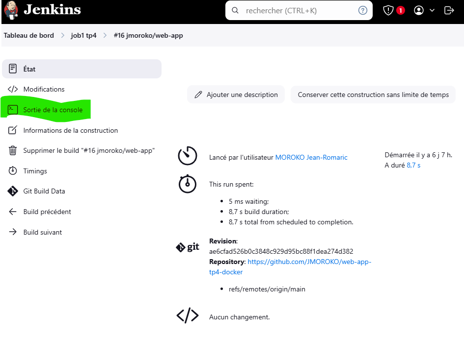
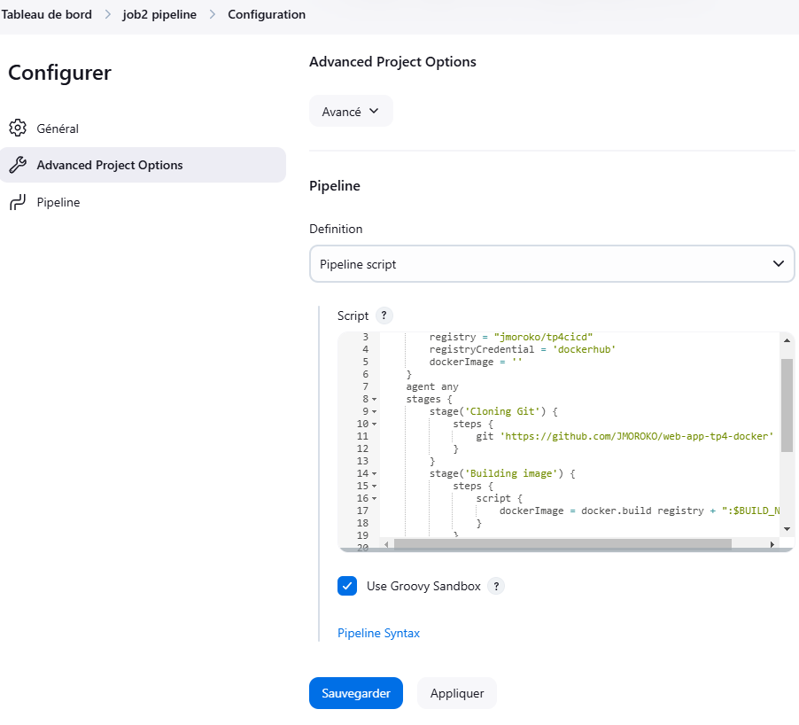
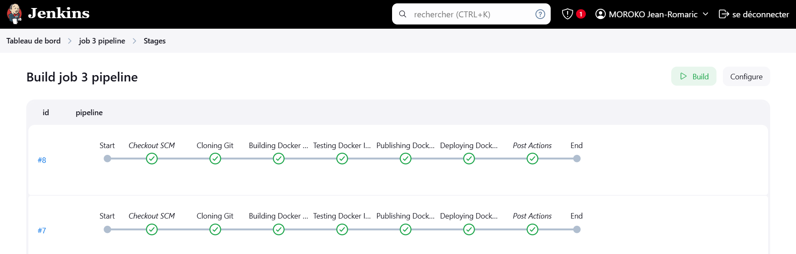

<h1>1. Création du projet et du fichier docker file</h1>

<b>Création du projet HTML</b>

<b>Création du fichier dockerFile</b>

<h1>2. Installation de jenkins</h1>

<b>Téléchargement de jenkins et installation basique</b>

<b>Configuration</b>

Aller dans les services de windows et rechercher le service jenkins

 

Double cliquer sur jenkins, aller dans l'onglet connexion, cliquer sur ce compte, faire parcourir, ajouter le nom d'utilisateur de session de votre machine.
Mette le mot de passe d'ouverture de session de la machine et la confirmer.

<b>Configuration de docker tcp dans jenkins</b>

  
 

<b>Configuration de docker desktop</b>

Il faut utiliser le même compte que vous compter utiliser dans docker hub

<h1>3. Installation des plugins</h1>

<h1>4. Création du job jenkins</h1>
  
  
<h1>5. Configuration du job jenkins</h1>
  
  
  
 
<h1>6. Test de la configuration</h1>

<b>Lancer le job</b>

<b>En cas d'erreur</b>

Cliquer sur le dernier numéro d'exécution du job

Ensuite cliquer sur sortie console

Aller jusqu'en bas du fichier pour voir le message d'erreur

<h1>7. Mise à jour du projet github</h1>

Un push dans github enclanche automatiquement un build dans jenkins

  

<h1>8. Supprimer le job dans jenkins</h1>

   
<h1>9. Partie 2 CI/CD => Intégration continue / Déploiement continue</h1>

Il faut reprendre toutes les étapes précédente et ajouter un script shell

  

<b>Lancement automatique du job</b>

  
  
<h1>10. Créer un job 2 de type pipeline</h1>
 

<b>Configuration</b>

<pre>
pipeline {
    environment {
        registry = "jmoroko/tp4cicd"
        registryCredential = 'dockerhub'
        dockerImage = ''
        DOCKER_HOST = 'npipe:////./pipe/docker_engine'
    }
    agent any
    stages {
        stage('Cloning Git') {
            steps {
                git branch: 'main', 
                    credentialsId: 'jmoroko', 
                    url: 'https://github.com/JMOROKO/web-app-tp4-docker.git'
            }
        }
        stage('Building image') {
            steps {
                script {
                    dockerImage = docker.build("${registry}:${BUILD_NUMBER}")
                }
            }
        }
        stage('Publish Image') {
            steps {
                script {
                    docker.withRegistry('https://index.docker.io/v1/', registryCredential) {
                        dockerImage.push()
                        dockerImage.push('latest')
                    }
                }
            }
        }
    }
}
</pre>
<h1>10. Créer un job 3 de type pipeline</h1>

<b>Configuration contenu du fichier : Jenkinsfile </b>

<pre>
pipeline {
    environment {
        registry = "jmoroko/tp4cicd"
        registryCredential = 'dockerhub' // ID des credentials Docker Hub dans Jenkins
        dockerImage = ''
        DOCKER_HOST = 'npipe:////./pipe/docker_engine' // Pour Windows
    }
    agent any
    stages {
        stage('Cloning Git') {
            steps {
                git branch: 'main',
                    credentialsId: 'jmoroko',
                    url: 'https://github.com/JMOROKO/web-app-tp4-docker.git'
            }
        }
        stage('Building Docker Image') {
            steps {
                script {
                    echo "Building Docker image..."
                    dockerImage = docker.build("${registry}:${BUILD_NUMBER}")
                }
            }
        }
        stage('Testing Docker Image') {
            steps {
                script {
                    echo "Running tests on Docker image..."
                    // Remplacez par des tests réels si nécessaire
                    echo "Tests passed"
                }
            }
        }
        stage('Publishing Docker Image') {
            steps {
                script {
                    echo "Publishing Docker image to Docker Hub..."
                    docker.withRegistry('https://index.docker.io/v1/', registryCredential) {
                        dockerImage.push() // Push avec le numéro de build
                        dockerImage.push('latest') // Push avec le tag 'latest'
                    }
                }
            }
        }
        stage('Deploying Docker Image') {
            steps {
                script {
                    echo "Deploying Docker image..."
                    // Commande pour lancer le conteneur Docker sur Windows
                    bat "docker run -d -p 8080:80 --name app-${BUILD_NUMBER} ${registry}:${BUILD_NUMBER}"
                }
            }
        }
    }
}

</pre>
<h1>11. Créer un job 3 et coupler le script Jenkinsfile au job 3</h1>
  
  
<!--  -->

<b>Lancer le build</b>

<h1>12. Resultat de la mise en place du pipeline</h1>

<b>Installation du plugins view stage</b>

<h2>13. Resultat du déploiement dans docker desktop</h2>
 
<h2>14. Affichage de l'application déployé sur mon navigateur</h2>
